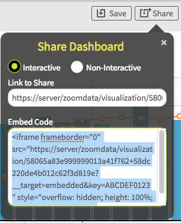

## Introduction

The Zoomdata Web application enables users to visualize and analyze billions of rows from a wide range of data sources.
Using Zoomdata’s query engine and connectivity layers, charts in Zoomdata quickly and easily show data from big data sources, traditional
relational databases, search sources, files, MPP databases, and rest endpoints.  However, some customers want to display data from Zoomdata
outside of the Zoomdata application.

Customers may have an existing Web application in which they want to display data from Zoomdata.  Or, a customer may want to develop a
completely new user experience which incorporates data from sources connected to Zoomdata.  Customers requiring this level of integration
have three alternatives for embedding Zoomdata in their application.  Each of these has a trade offs between level of integration required
and flexibility of the solution.

| Embed Method | Strengths | Constraints |
|:---------------:|:-------------------------------------------------------------------------------------------------------------------------------------------------------------------------------------:|:-------------------------------------------------------------------------------------------------------------------------------------------------------------------------------------------------------------------------------------------------------------------------------------------------------------------------------------:|
| iframe | The easiest method to get Zoomdata visualizations into your application, little development required, delivers Zoomdata’s full data exploration experience | Interaction only available within the iframe. |
| Chart Embed SDK | Chart drawing and configuration handled by Zoomdata charts can be configured anywhere in the application. The developer does not have to deal with drawing or updating chart elements | Developer has to track all charts and update associated queries to change filters, group by, and other attributes. Only the chart is provided by Zoomdata, other controls such as axis labels, legends, tooltips, and interaction are the responsibility of the application developer (using data and functions available in the SDK) |
| Data Query SDK | The developer builds the query and receives the results and has the flexibility to display in any form desired. | Developer is responsible for all user interface components and charting of the query results. Requires more effort to perform the integration and more code to maintain. |

All embed methods require the customer have application development staff with the skills and resources to perform the embed.
The iframe embed requires understanding of authoring HTML and associated styling.  Chart Embed and Data Query also require expertise in
Javascript application development. Zoomdata does not require knowledge of a specific Javascript framework for embedding, the SDK can be
used with any framework such as React or Angular.

## Method 1: iframe
An iframe embed is the fastest and easiest way to get Zoomdata visualization and functionality into a web application.  “iframe” is a
standard HTML tag that embeds a new browser context within a page.  For details on iframe consult documentation such as
https://developer.mozilla.org/en-US/docs/Web/HTML/Element/iframe. The content of the iframe is provided entirely by the Zoomdata Web
application. The developer of the containing application does not need to understand any Zoomdata SDK beyond a single iframe tag that is
provided by Zoomdata via the “Share” button on the dashboard.  As shown in Figure 1, this button displays a dialog with the explicit HTML
tag to use in the embed application to show the iframe.

**Figure 1:** Generating the iframe tag using the Share button on a dashboard.

To embed the dashboard in the application simply insert the entire tag in the “Embed Code” dialog into the HTML of the application’s page.
The application then displays the dashboard, including any configuration options such as the time bar.  Selecting the “Interactive” or
“Non-Interactive” option when sharing the dashboard configures the actions the user can perform in the embedded dashboard.

Application developers should select the iframe embed approach when they want to display fully functional Zoomdata dashboards with
limited need for interaction between the parent application and the dashboard.

##Method 2: Chart Embedding SDK

Developers using the chart embed SDK get the flexibility to configure and position charts anywhere in their application, without having
to implement chart rendering and maintenance.  Any Zoomdata chart  can be embedded in the parent application. Developers have the
flexibility to define all query parameters, select the chart type, and attach the chart to a specific *\
* in the application.

Once the visualization has been created and displayed the developer does not have to program data updates. The chart automatically redraws
in response to data changes due to sharpening, streaming, or  query configuration (filters, time, group by, metric).

By default, the chart embedded through this SDK does not contain any of the decorative or interactive elements seen in the Zoomdata
application.  Elements such as axis labels, legend, tooltip, and click interaction menus are removed, giving the developer full freedom
to implement those elements based on the need of their project.  The chart SDK exposes events and properties to populate those elements.
For example, the developer can implement a legend using the values and associated colors available in the *getDomain* method of the
*dataAccessor* object.

Application developers should choose the Chart Embedding approach when they need to display data from Zoomdata, have control over page
layout, and independently control chart parameters such as filters, metrics, etc.

## Method 3: Data Query SDK

With the Data Query SDK developers gain access to the data results from Zoomdata without any UI components. Application developers have
complete flexibility to display the data in any format appropriate to the application. They may use a library such as D3 or eCharts, or
they may choose to integrate the data with other aspects of the application. The Data Query SDK provides functions to generate queries to
any configured data source in Zoomdata, without needing to understand the underlying data storage technology. Data queries automatically
incorporate Zoomdata capabilities such as data access control, sharpening and streaming.

Application developers should consider the Data Query SDK when they need to obtain data through Zoomdata, but drive the entire design and
display of data independent of Zoomdata.  This approach takes advantage of the Zoomdata query engine’s ability to access a variety of data sources, handle streaming data,
and high performance responsiveness.

## Conclusion

The spectrum of available options for embedding Zoomdata visualizations in customer applications support many different use cases.
Customers work with their internal development team to balance the ease of use of an embed technique against the flexibility needed for
the application, with the associated burden of development and maintenance for the more flexible approaches.

Zoomdata includes other customization options, described in the documentation, but not addressed in this article.
These options can be used in a Zoomdata application environment, or in conjunction with an embedding strategy, to provide even more
capability to the end user:
- White labeling: Allows the customer to style the Zoomdata application with company or application specific look and feel
- Custom Charts: Developers can build their own charts to display data in unique ways. These charts can be used in the Zoomdata
application or embedded using the Embed SDK
- REST API: Operations to configure Zoomdata, manipulate dashboard/bookmark configurations, and obtain the metadata associated with
sources are available by REST calls.  These are powerful tools to incorporate into embed scenarios to interact with Zoomdata beyond the SDK functions available
- Custom Data Connector: Building a custom connectors allows Zoomdata to query a new data source, which becomes available to charts and
data queries used in the Zoomdata application and in embedded applications

## Resources
Developers should start with the Zoomdata Developer Zone. This site is the entry point for all documentation and samples for the SDK
and API techniques described in this document.  
https://www.zoomdata.com/developers/

General documentation for Zoomdata describes the use and administration of the application.  
https://docs.zoomdata.com

Product and company information is available on the main Zoomdata web site.  
https://www.zoomdata.com