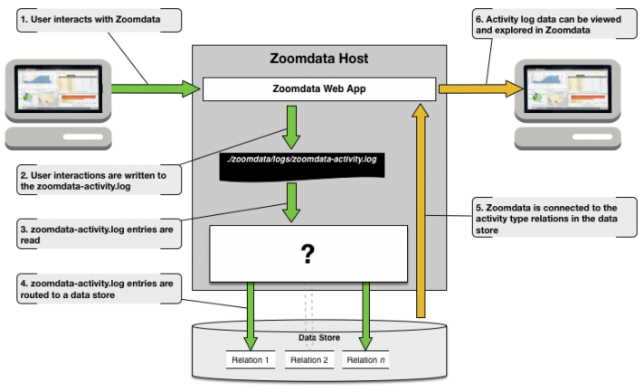

When working with security conscious customers, the Zoomdata Customer Success team is often confronted with the question
of how to best audit user activity. These customers have typically already enabled [user activity logging](https://www.zoomdata.com/docs/2.6/activity-logging.html)
and are now looking to make that data consumable and actionable for application administrators. The conversation usually starts with something like this:

**...Now that I’ve enabled activity logging FOR Zoomdata, how do I view those logs IN Zoomdata?**

It’s a very reasonable question. What’s missing is a connection between Zoomdata and its own log data. I agree, it would be nice if
that was available in Zoomdata out-of-the-box (ahem, Zoomdata product team ☺), but since a stock connection to our activity logs is
not yet available we’ll need to craft our own solution.

Taking a step back, there are many ways to collect log data from a file system and route it to any of the growing number of data
stores that Zoomdata can connect to. The flavor of these solutions will depend on the tools and data stores available in the environment,
but all will follow the same basic recipe:

**...considerations...**

We’ll need to consider schema variation between activity type entries if we plan to load the entire log into a single relation.
Details on the individual activities that can be logged and the format of those log entries can be found in [Zoomdata’s documentation](https://www.zoomdata.com/docs/2.6/activities-log-quick-reference-sheet.html).
Data stores that support schemaless or dynamic schema modes (Solr or Elasticsearch) can handle this easily with minimal setup, but this
approach increases data sparsity.

An alternative is to create a relation for each activity type (with appropriate schema) and route entries to the appropriate relation as
they are read out of the log. I prefer this approach as it reduces data sparsity even though it means a bit more work setting it all up.

**...how can we keep this simple?**

That depends. If you already have a solution in your environment that will get the log data where it needs to go, then let’s use that.
Just remember what I said about schema variation in the log entries. Also, confirm that Zoomdata connects to the data store where your
solution lands the log data. Alternatively, one could use a tool like [Fluentd](https://www.fluentd.org/), as it provides parsing capabilities that will help filter
and route the log data as needed. Plus, Fluentd integrates well with Zoomdata’s microservices (see [Unified Logging](https://www.zoomdata.com/docs/2.6/unified-logging.html)) and supports a
number of outputs that Zoomdata can read out-of-the-box.

**…but I’d rather not install and manage another application (Fluentd)**

Not to worry. Looks like the Zoomdata Customer Success team was nice enough to write a Dockerfile and usage instructions.
Details are available on [Github](https://github.com/Zoomdata/zoomdata-tools/tree/master/user-activity-log-helper). That will get you started with PostgreSQL for now, but support for other outputs will be coming in
the near future.

**...ok, can I get an alert, for example, when a user deletes something?**

More on that later...
