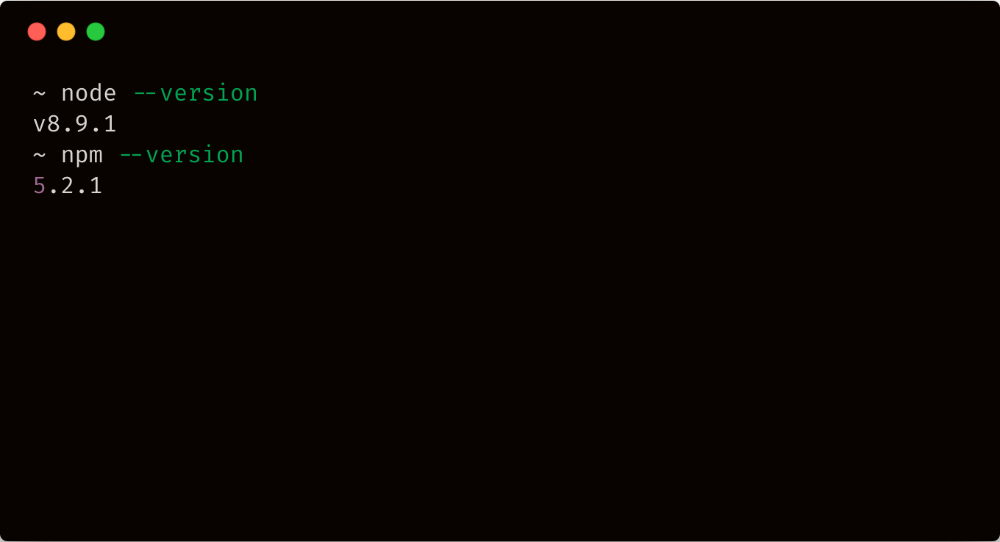
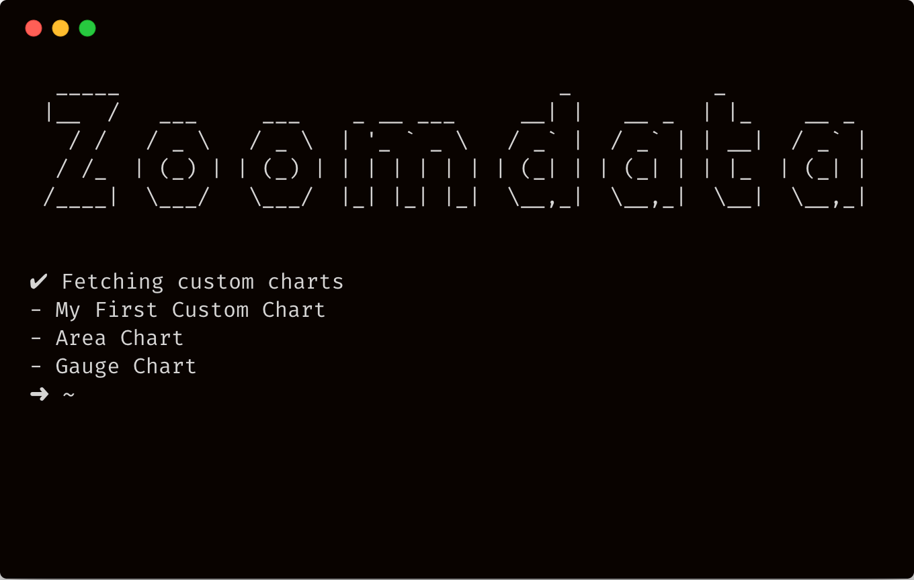
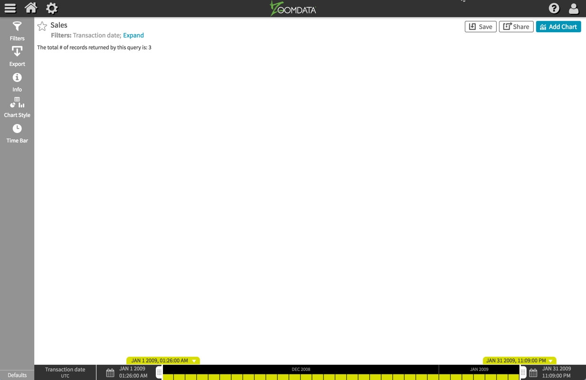

Welcome to part one of the custom chart tutorial. In this part of the tutorial, you'll be introduced the Custom Chart CLI,
how to create an blank custom chart, how to edit the chart's code, and how to preview the chart.

Let's dive right in!

## Check your development environment

Let's check first that you have everything set up to start creating custom charts with Zoomdata.
You will need a recent version of Node.js installed.

Node.js is a programming tool for running JavaScript on servers and in your
computer's terminal. The Zoomdata Chart CLI is built using Node.js.

Open a terminal window. See
[terminal instructions for Mac users](http://www.macworld.co.uk/feature/mac-software/how-use-terminal-on-mac-3608274/) and
[terminal instructions for Windows users](https://www.quora.com/How-do-I-open-terminal-in-windows). In your terminal window, type `node --version` and hit ENTER, then `npm --version` and hit ENTER.

You should see something like:



The Zoomdata Chart CLI supports versions of Node back to v6 and npm to v3.

If you don't have Node.js installed, go to https://nodejs.org/ and install the
recommended version for your operating system.

## Install & Configure the Zoomdata Chart CLI

Zoomdata uses the a CLI to build, edit, and remove custom charts. To install the CLI, type the following command into the terminal
window and hit ENTER.

```sh
npm install zoomdata-chart-cli -g
```

Once that's installed, type the following command in and hit ENTER:
```sh
zd-chart config
```

The config command prompts you for the following information:
1. Your Zoomdata server URL.
2. The username to use for authentication. (typically: _admin_)
3. The password the username.

Upon entering the information, you'll be asked to store its contents in an encrypted configuration file residing
in your home directory (*~/.config/zoomdata/zd-chart.pref*). Enter "y" and your environment is now configured.

Now let's check the everything is setup correctly by listing the custom charts available in the configured server:
(Note: If this server doesn't contain any custom charts, the output of the *ls* command will be an empty list)

```sh
zd-chart ls
```



Great! Everything seems to be setup correctly.

## Create a Blank Custom Chart

Out of the box, Zoomdata provides a list of chart templates that can be used as a starting point for your new custom chart.
In this tutorial, we'll start out with the **Blank** template -- an empty chart skeleton with minimal code designed to get
you familiar with the basics of the charts API.

Type the following command into a terminal window and hit ENTER:

```sh
zd-chart create
```

The create command will prompt you for the following information:
1. A name for you custom chart: Enter "My First Custom Chart".
2. The selection of a built in template to start from: Select "Blank" and press ENTER.
3. A Zoomdata source to configure with the new custom chart: Select one of the sources available in your server.

If everything goes right, you'll be asked if you want to edit the new chart. Enter "Y" to edit the chart.

We'll want to enable the chart so that's available in the menus when creating a new dashboard. Select
**Visibility** and enter "Y" to enable the chart.

## Edit the Chart's Code

We are ready to get into the chart's code. Zoomdata's charts are composed of one or more **components**. You can think of them as CSS and JS
files that make up your chart's code. The chart CLI let's you update the chart's code in one of three ways:
1. Modifying a chart's component directly through the CLI using the *Edit* command.
2. Pushing an updated local copy of the chart back to the server/
3. Using *Watch* mode to continuously check for changes to the local component files and automatically update the server's copy.

Throughout this tutorial, we'll continuously modify code while previewing the changes. It's best to use *Watch* mode in this scenario.
Let's start out by pulling a copy of the chart to your development environment's local file system. Type the following command into the terminal
window and hit ENTER.

```sh
zd-chart pull "My First Custom Chart" --dir <some-local-directory>
```

In your terminal window, `cd` to the directory specified in the *pull* command. You should see a directory named: "my-first-custom-chart" with the following content:
```sh
.
├── components
│   ├── Visualization.js
│   └── style.css
├── libs
│   └── lodash.min.js
├── version
└── visualization.json
```

Now type the following command and press ENTER
```sh
zd-chart watch
```

The CLI will start watching for changes in the component files *Visualization.js* and *style.css*. Open the *Visualization.js*
file in your preferred text editor or IDE. Let's modify the code to output some text on the chart with the total number fo records
returned by default query.

```javascript
/* global controller */

controller.update = function(data) {
    // Called when new data arrives
    controller.element.innerHTML =
    'The total # of records returned by this query is: ' + data.length;
};

```

Return to the terminal window where watch mode is enabled, and you should see message showing that the *Visualization.js* was updated.

## Preview the Chart

Let's take a look at the new chart in Zoomdata
1. Log-in to the Zoomdata server that's hosting the custom chart.
2. From the home page, click on the blue *New* button and select *Chart & Dashboards*;
3. Select the data source you configured with the chart.
4. Select "My First Custom Chart".

Your chart should look similar to the following image:



##Cool!

You've made it through the part one of the custom chart tutorial. So far, you've learned how to install and configure
the Zoomdata Chart CLI, how to create a new blank chart, and how to update its code and preview the results.
Feel free to continue now to [the second part of the tutorial](/tutorial/part-two/) or go exploring around
the rest of the site.